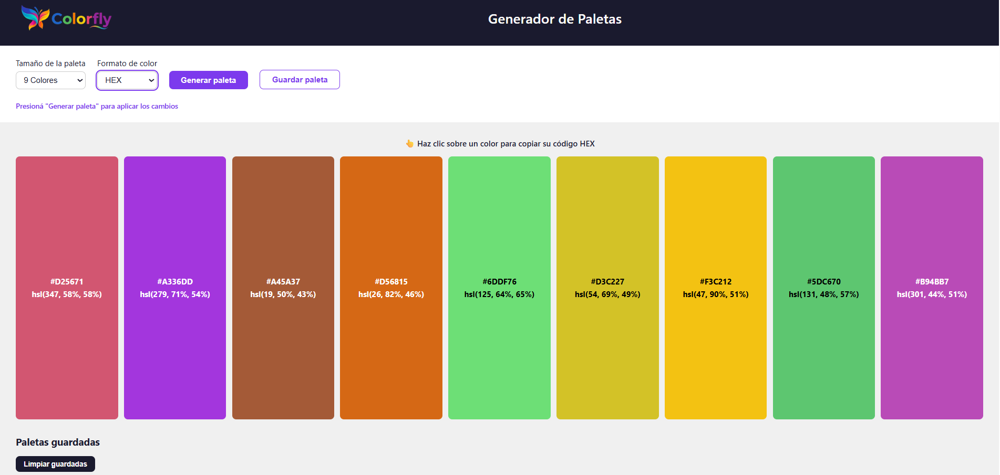
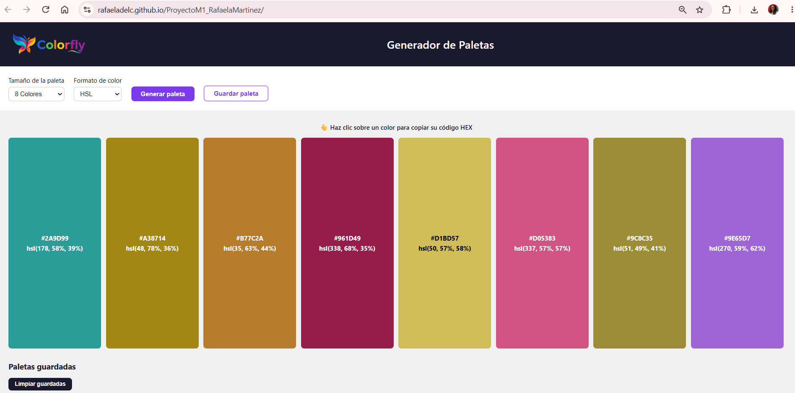
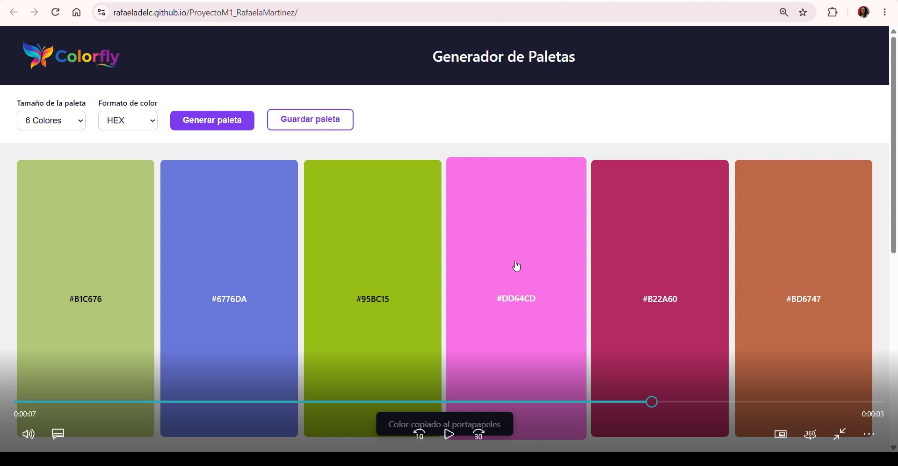
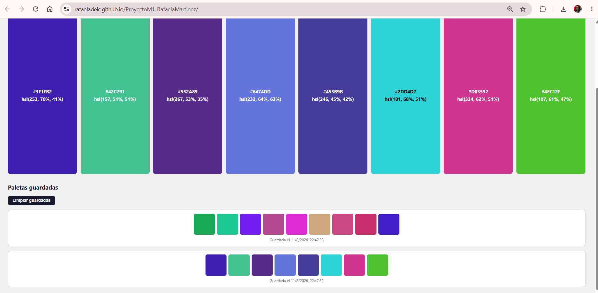
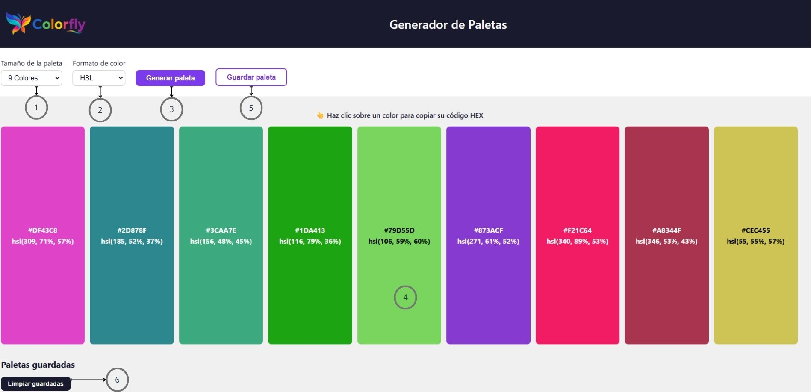

# 🎨 Generador de Paletas de Colores — Colorfly

Aplicación web estática e interactiva que genera paletas de colores aleatorias.
Proyecto Integrador — Módulo 1, Bootcamp Full Stack (Henry).

## 📋 Descripción

Colorfly Studio es una agencia de branding que necesita acelerar su flujo
creativo. Esta herramienta permite generar paletas de colores aleatorias de
forma rápida e intuitiva, mostrando cada color junto a su código de color
(HEX y HSL) para usarlo directamente en propuestas visuales.

## 🚀 Demo

🔗 **[Ver demo en vivo](https://rafaeladelc.github.io/ProyectoM1_RafaelaMartinez/)**

## 🖼️ Capturas









## 🛠️ Tecnologías

- HTML5 semántico
- CSS3 (Grid / Flexbox / Variables)
- JavaScript (ES6, manipulación del DOM)
- localStorage (persistencia de datos)
- Git y GitHub
- GitHub Pages

## ✨ Funcionalidades

- [x] Selección del tamaño de la paleta (6, 8 o 9 colores)
- [x] Generación de colores aleatorios en formato HSL y HEX
- [x] Visualización de cada color con su código
- [x] Copiar el código HEX al portapapeles al hacer clic sobre un color
- [x] Guardar paletas favoritas con localStorage
- [x] Microfeedback visible al interactuar (notificaciones)
- [x] Accesibilidad básica: labels asociados, contraste y foco visible

## 📖 Instrucciones de uso

1. **Seleccione el tamaño** de la paleta en el selector "Tamaño de la paleta" (6, 8 o 9 colores).
2. **Seleccione el formato** de color: HEX (muestra solo el código HEX) o HSL (muestra HSL y su HEX equivalente).
3. **Presione "Generar paleta"** para crear una nueva combinación de colores aleatorios.
4. **Haga clic sobre cualquier color** para copiar su código HEX al portapapeles.
5. **Presione "Guardar paleta"** para almacenar la paleta actual en sus favoritas (se conservan aunque cierre el navegador).
6. **Presione "Limpiar guardadas"** para borrar todas las paletas almacenadas.



## 💻 Cómo ejecutar el proyecto en local

1. Clone el repositorio:
```bash
   git clone https://github.com/Rafaeladelc/ProyectoM1_RafaelaMartinez.git
```
2. Ingrese a la carpeta del proyecto:
```bash
   cd ProyectoM1_RafaelaMartinez
```
3. Abra el proyecto con **Live Server** (extensión de VS Code) o con cualquier servidor local.

> ⚠️ **Importante:** la función de copiar al portapapeles requiere que la página se sirva por **HTTPS o localhost** (por seguridad del navegador). Por esta razón se recomienda usar Live Server en lugar de abrir el `index.html` con doble clic.

## 🌐 Cómo desplegar en GitHub Pages

1. Suba el proyecto a un repositorio de GitHub.
2. En el repositorio, ingrese a **Settings → Pages**.
3. En **Source**, seleccione "Deploy from a branch".
4. Seleccione la rama **main** y la carpeta **/ (root)**.
5. Guarde. En unos minutos la aplicación estará disponible en la URL que GitHub genera.

## 🧠 Decisiones técnicas

- **Generación en HSL como fuente de verdad:** los colores se generan siempre en HSL y luego se convierten a HEX (ruta HSL → RGB → HEX). Se eligió HSL porque permite controlar la saturación (40–90%) y la luminosidad (35–65%), evitando colores apagados o poco legibles y logrando paletas más armónicas. Generar en HEX directamente no permitiría ese control.

- **Contraste de texto por luminancia:** el color del texto sobre cada franja (negro o blanco) se decide calculando la luminancia percibida del fondo (fórmula 0.299·R + 0.587·G + 0.114·B). Esto garantiza contraste suficiente sin importar el color generado, cumpliendo con la accesibilidad.

- **Grid con clases modificadoras:** la cantidad exacta de columnas (6, 8 o 9) se controla con clases CSS (`.contenedor-paleta--6/8/9`) en lugar de `auto-fit`, para garantizar que siempre se muestre el número exacto seleccionado.

- **Persistencia con localStorage:** las paletas guardadas se almacenan como texto (con `JSON.stringify`) y se recuperan al cargar la página, permitiendo que sobrevivan al cierre del navegador.

- **Variables CSS:** los colores principales se definen en `:root` como variables, para mantener consistencia y facilitar cambios globales.

## 📁 Estructura del proyecto
```
ProyectoM1_RafaelaMartinez/
├── index.html          # Estructura semántica
├── css/
│   └── styles.css      # Estilos, grid y variables
├── js/
│   └── script.js       # Lógica de generación y DOM
├── img/                # Capturas y recursos visuales
└── README.md           # Este archivo
```

## 👩‍💻 Autora

Rafaela Martinez — Proyecto Integrador Módulo 1, Bootcamp Full Stack (Henry).